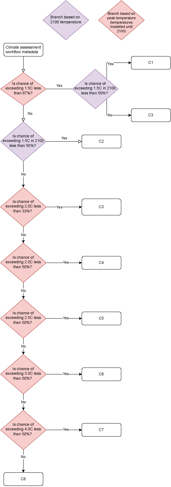

.. _workflow:

Description of the workflow
***************************
On this page, you will find a short summary of the main function of this package.
The workflow is described in detail in the following manuscript:

  | Jarmo S. Kikstra, Zebedee R. J. Nicholls, Christopher J. Smith, Jared Lewis, Robin D. Lamboll, Edward Byers, Marit Sandstad, Malte Meinshausen, Matthew J. Gidden, Joeri Rogelj, Elmar Kriegler, Glen P. Peters, Jan S. Fuglestvedt, Ragnhild B. Skeie, Bjørn H. Samset, Laura Wienpahl, Detlef P. van Vuuren, Kaj-Ivar van der Wijst, Alaa Al Khourdajie, Piers M. Forster, Andy Reisinger, Roberto Schaeffer, and Keywan Riahi
  | "The IPCC Sixth Assessment Report WGIII climate assessment of mitigation pathways: from emissions to global temperatures".
  | *Geosci. Model Dev., 15, 9075–9109*
  | https://doi.org/10.5194/gmd-15-9075-2022
  | 2022

Integrated assessment models (IAMs) produce emissions pathways as part of larger pathway output coming from the modelling of scenarios.
These emissions pathways imply a certain temperature development.

Some integrated assessment modelling teams can provide their own climate model runs based on these emissions outcomes,
others just work on the level of emissions.
Not all IAMs model all societal processes that cause emissions and therefore not all models report pathways for all emissions species for all scenarios.
On top of that, for comparability, using the same climate model serves purposes of comparability.
For a comprehensive assessment of all available long-term greenhouse gas emissions scenarios, like in the
working group III (WGIII) contribution to the IPCC Sixth Assessment report (AR6), both
consistency and calibration are required.

The workflow that ensures both this consistency and calibration is as follows (see also Figure 1):

0. Calibrating historical temperatures in climate emulators have to be harmonized to a historical temperature assessment and climate parameters across emulators have to be calibrated;
1. Preparing scenarios with emissions pathways;
2. “Harmonization”: Emissions pathways from IAM scenarios have to be harmonized against historical emissions observations in order to start from the same emissions levels (while still respecting the trends as described in the pathways);
3. “Infilling”: in order to assess each scenario based on a complete set of emissions, we need to infer missing (non-reported) emissions pathways (which can be more or less important depending on exactly what they are) for each scenario;
4. “Climate” – running earth system model emulators.

.. figure:: _static/overview_workflow.png
  :width: 600
  :alt: Overview of the AR6 workflow.

  **Figure 1**: Overview of the AR6 workflow.

`Step 0.` was done in Chapter 7 of the working group I (WGI) contribution to AR6.
The earth system model emulators (also called 'climate emulator', 'emulator', 'reduced complexity model', or 'simple climate model'),
also analyzed in the Reduced Complexity Model Intercomparison Project (RCMIP) Phase 1 and Phase 2, are run using the ``openscm-runner`` package.

`Step 1.` in AR6 was done by modelling teams across the world, with the scenarios submitted to and made available in the AR6 Scenario Database Explorer.

`Step 2.`, `step 3.`, and `step 4`. are performed by this package.

Expected Input (Step 1)
=======================

The expected input is in the following format, as either an Excel (.xlsx) or CSV (.csv) file, covering 2015, and then at minimum decadal (up to yearly detail is accepted) timesteps from 2020 to 2100.
Currently, no meta data from the input data is used or preserved in the workflow.
At minimum, one needs to report `Emissions|CO2|Energy and Industrial Processes`.
Emissions baskets or species not in the table below are not considered for the eventual climate assessment, but are automatically infilled.
In this version, negative values are only allowed as input for CO2.

+--------+-----------+---------+------------------------------------------------+-----------------+-------+----+----+-------+
| Model  | Scenario  | Region  | Variable                                       | Unit            | 2015  | …  | …  | 2100  |
+========+===========+=========+================================================+=================+=======+====+====+=======+
|        |           | World   | Emissions|BC                                   | Mt BC/yr        |       |    |    |       |
+--------+-----------+---------+------------------------------------------------+-----------------+-------+----+----+-------+
|        |           | World   | Emissions|CH4                                  | Mt CH4/yr       |       |    |    |       |
+--------+-----------+---------+------------------------------------------------+-----------------+-------+----+----+-------+
|        |           | World   | Emissions|CO                                   | Mt CO/yr        |       |    |    |       |
+--------+-----------+---------+------------------------------------------------+-----------------+-------+----+----+-------+
|        |           | World   | Emissions|CO2|AFOLU                            | Mt CO2/yr       |       |    |    |       |
+--------+-----------+---------+------------------------------------------------+-----------------+-------+----+----+-------+
|        |           | World   | Emissions|CO2|Energy and Industrial Processes  | Mt CO2/yr       |       |    |    |       |
+--------+-----------+---------+------------------------------------------------+-----------------+-------+----+----+-------+
|        |           | World   | Emissions|HFC|HFC125                           | kt HFC125/yr    |       |    |    |       |
+--------+-----------+---------+------------------------------------------------+-----------------+-------+----+----+-------+
|        |           | World   | Emissions|HFC|HFC134a                          | kt HFC134a/yr   |       |    |    |       |
+--------+-----------+---------+------------------------------------------------+-----------------+-------+----+----+-------+
|        |           | World   | Emissions|HFC|HFC143a                          | kt HFC143a/yr   |       |    |    |       |
+--------+-----------+---------+------------------------------------------------+-----------------+-------+----+----+-------+
|        |           | World   | Emissions|HFC|HFC23                            | kt HFC23/yr     |       |    |    |       |
+--------+-----------+---------+------------------------------------------------+-----------------+-------+----+----+-------+
|        |           | World   | Emissions|HFC|HFC32                            | kt HFC32/yr     |       |    |    |       |
+--------+-----------+---------+------------------------------------------------+-----------------+-------+----+----+-------+
|        |           | World   | Emissions|HFC|HFC43-10                         | kt HFC43-10/yr  |       |    |    |       |
+--------+-----------+---------+------------------------------------------------+-----------------+-------+----+----+-------+
|        |           | World   | Emissions|N2O                                  | kt N2O/yr       |       |    |    |       |
+--------+-----------+---------+------------------------------------------------+-----------------+-------+----+----+-------+
|        |           | World   | Emissions|NH3                                  | Mt NH3/yr       |       |    |    |       |
+--------+-----------+---------+------------------------------------------------+-----------------+-------+----+----+-------+
|        |           | World   | Emissions|NOx                                  | Mt NO2/yr       |       |    |    |       |
+--------+-----------+---------+------------------------------------------------+-----------------+-------+----+----+-------+
|        |           | World   | Emissions|OC                                   | Mt OC/yr        |       |    |    |       |
+--------+-----------+---------+------------------------------------------------+-----------------+-------+----+----+-------+
|        |           | World   | Emissions|PFC|C2F6                             | kt C2F6/yr      |       |    |    |       |
+--------+-----------+---------+------------------------------------------------+-----------------+-------+----+----+-------+
|        |           | World   | Emissions|PFC|C6F14                            | kt C6F14/yr     |       |    |    |       |
+--------+-----------+---------+------------------------------------------------+-----------------+-------+----+----+-------+
|        |           | World   | Emissions|PFC|CF4                              | kt CF4/yr       |       |    |    |       |
+--------+-----------+---------+------------------------------------------------+-----------------+-------+----+----+-------+
|        |           | World   | Emissions|SF6                                  | kt SF6/yr       |       |    |    |       |
+--------+-----------+---------+------------------------------------------------+-----------------+-------+----+----+-------+
|        |           | World   | Emissions|Sulfur                               | Mt SO2/yr       |       |    |    |       |
+--------+-----------+---------+------------------------------------------------+-----------------+-------+----+----+-------+
|        |           | World   | Emissions|VOC                                  | Mt VOC/yr       |       |    |    |       |
+--------+-----------+---------+------------------------------------------------+-----------------+-------+----+----+-------+

Workflow (Step 2-4)
===================

Harmonization (Step 2)
----------------------
Emissions harmonization refers to the process used to align modeled GHG and air
pollutant pathways with a common source of historical emissions. This capability
enables a common climate estimate across different models, increases transparency
and robustness of results, and allows for easier participation in intercomparison
exercises by using the same, openly available harmonization mechanism. We use the
open-source Python software package called ``aneris`` to achieve this aim.

Infilling (Step 3)
------------------
Infilling ensures that all relevant anthropogenic emissions are included in each
climate run for each scenario. This makes the climate assessment of alternative
scenarios more comparable and reduces the risk of a biased climate assessment,
because not all climatically active emission species are reported by all IAMs.
The infilling methods used are from an open-source Python software package
called ``silicone``.

Climate (Step 4)
----------------
After model-reported emissions pathways have been both harmonized and infilled, they are ready as input for climate emulators.
At the moment, three climate emulators are coupled to the workflow: FaIRv1.6.2, CICERO-SCM, and MAGICCv7.5.3.
These climate emulators are run in probabilistic mode, based on a multi-member input set (coming from the calibration done in AR6 WGI).
As this output is much too big to store (couple hundred MB per scenario per climate emulator),
we do not write this out but rather calculate statistics over the variables, which are then reported as output of the workflow.

Expected Output
===============

The output of the climate assessment workflow comes with both probabilistic scenario timeseries (data) and additional information per scenario (metdata).

Scenario metadata
-----------------

Each scenario that can be assessed by the climate emulators receives extensive climate metadata at the end of the workflow.
One key way that this metadata was used in the Sixth Assessment report was to classify scenarios in to temperature-based categories (from C1 to C8).
In the figure below you can see an overview of the classification scheme that was applied.

Timeseries data
---------------

The expected output is in the following format (here emulator MAGICCv7.5.3 is used as example):

+--------+-----------+---------+----------------------------------------------------------------------------------------+-------+-------+----+----+-------+
| Model  | Scenario  | Region  | Variable                                                                               | Unit  | 1995  | …  | …  | 2100  |
+========+===========+=========+========================================================================================+=======+=======+====+====+=======+
|        |           | World   | AR6 climate diagnostics|Atmospheric Concentrations|CH4|MAGICCv7.5.3|10.0th Percentile  | ppb   |       |    |    |       |
+--------+-----------+---------+----------------------------------------------------------------------------------------+-------+-------+----+----+-------+
|        |           | World   | AR6 climate diagnostics|Atmospheric Concentrations|CH4|MAGICCv7.5.3|16.7th Percentile  | ppb   |       |    |    |       |
+--------+-----------+---------+----------------------------------------------------------------------------------------+-------+-------+----+----+-------+
|        |           | World   | AR6 climate diagnostics|Atmospheric Concentrations|CH4|MAGICCv7.5.3|33.0th Percentile  | ppb   |       |    |    |       |
+--------+-----------+---------+----------------------------------------------------------------------------------------+-------+-------+----+----+-------+
|        |           | World   | AR6 climate diagnostics|Atmospheric Concentrations|CH4|MAGICCv7.5.3|5.0th Percentile   | ppb   |       |    |    |       |
+--------+-----------+---------+----------------------------------------------------------------------------------------+-------+-------+----+----+-------+
|        |           | World   | AR6 climate diagnostics|Atmospheric Concentrations|CH4|MAGICCv7.5.3|50.0th Percentile  | ppb   |       |    |    |       |
+--------+-----------+---------+----------------------------------------------------------------------------------------+-------+-------+----+----+-------+
|        |           | World   | AR6 climate diagnostics|Atmospheric Concentrations|CH4|MAGICCv7.5.3|67.0th Percentile  | ppb   |       |    |    |       |
+--------+-----------+---------+----------------------------------------------------------------------------------------+-------+-------+----+----+-------+
|        |           | World   | AR6 climate diagnostics|Atmospheric Concentrations|CH4|MAGICCv7.5.3|83.3th Percentile  | ppb   |       |    |    |       |
+--------+-----------+---------+----------------------------------------------------------------------------------------+-------+-------+----+----+-------+
|        |           | World   | AR6 climate diagnostics|Atmospheric Concentrations|CH4|MAGICCv7.5.3|90.0th Percentile  | ppb   |       |    |    |       |
+--------+-----------+---------+----------------------------------------------------------------------------------------+-------+-------+----+----+-------+
|        |           | World   | AR6 climate diagnostics|Atmospheric Concentrations|CH4|MAGICCv7.5.3|95.0th Percentile  | ppb   |       |    |    |       |
+--------+-----------+---------+----------------------------------------------------------------------------------------+-------+-------+----+----+-------+
|        |           | World   | AR6 climate diagnostics|Atmospheric Concentrations|CO2|MAGICCv7.5.3|10.0th Percentile  | ppm   |       |    |    |       |
+--------+-----------+---------+----------------------------------------------------------------------------------------+-------+-------+----+----+-------+
|        |           | World   | AR6 climate diagnostics|Atmospheric Concentrations|CO2|MAGICCv7.5.3|16.7th Percentile  | ppm   |       |    |    |       |
+--------+-----------+---------+----------------------------------------------------------------------------------------+-------+-------+----+----+-------+
|        |           | World   | AR6 climate diagnostics|Atmospheric Concentrations|CO2|MAGICCv7.5.3|33.0th Percentile  | ppm   |       |    |    |       |
+--------+-----------+---------+----------------------------------------------------------------------------------------+-------+-------+----+----+-------+
|        |           | World   | AR6 climate diagnostics|Atmospheric Concentrations|CO2|MAGICCv7.5.3|5.0th Percentile   | ppm   |       |    |    |       |
+--------+-----------+---------+----------------------------------------------------------------------------------------+-------+-------+----+----+-------+
|        |           | World   | AR6 climate diagnostics|Atmospheric Concentrations|CO2|MAGICCv7.5.3|50.0th Percentile  | ppm   |       |    |    |       |
+--------+-----------+---------+----------------------------------------------------------------------------------------+-------+-------+----+----+-------+
|        |           | World   | AR6 climate diagnostics|Atmospheric Concentrations|CO2|MAGICCv7.5.3|67.0th Percentile  | ppm   |       |    |    |       |
+--------+-----------+---------+----------------------------------------------------------------------------------------+-------+-------+----+----+-------+
|        |           | World   | AR6 climate diagnostics|Atmospheric Concentrations|CO2|MAGICCv7.5.3|83.3th Percentile  | ppm   |       |    |    |       |
+--------+-----------+---------+----------------------------------------------------------------------------------------+-------+-------+----+----+-------+
|        |           | World   | AR6 climate diagnostics|Atmospheric Concentrations|CO2|MAGICCv7.5.3|90.0th Percentile  | ppm   |       |    |    |       |
+--------+-----------+---------+----------------------------------------------------------------------------------------+-------+-------+----+----+-------+
|        |           | World   | AR6 climate diagnostics|Atmospheric Concentrations|CO2|MAGICCv7.5.3|95.0th Percentile  | ppm   |       |    |    |       |
+--------+-----------+---------+----------------------------------------------------------------------------------------+-------+-------+----+----+-------+
|        |           | World   | AR6 climate diagnostics|Atmospheric Concentrations|N2O|MAGICCv7.5.3|10.0th Percentile  | ppb   |       |    |    |       |
+--------+-----------+---------+----------------------------------------------------------------------------------------+-------+-------+----+----+-------+
|        |           | World   | ...                                                                                    | ...   |       |    |    |       |
+--------+-----------+---------+----------------------------------------------------------------------------------------+-------+-------+----+----+-------+
|        |           | World   | AR6 climate diagnostics|Surface Temperature (GSAT)|MAGICCv7.5.3|50.0th Percentile      | K     |       |    |    |       |
+--------+-----------+---------+----------------------------------------------------------------------------------------+-------+-------+----+----+-------+
|        |           | World   | AR6 climate diagnostics|Surface Temperature (GSAT)|MAGICCv7.5.3|67.0th Percentile      | K     |       |    |    |       |
+--------+-----------+---------+----------------------------------------------------------------------------------------+-------+-------+----+----+-------+
|        |           | World   | AR6 climate diagnostics|Surface Temperature (GSAT)|MAGICCv7.5.3|83.3th Percentile      | K     |       |    |    |       |
+--------+-----------+---------+----------------------------------------------------------------------------------------+-------+-------+----+----+-------+
|        |           | World   | AR6 climate diagnostics|Surface Temperature (GSAT)|MAGICCv7.5.3|90.0th Percentile      | K     |       |    |    |       |
+--------+-----------+---------+----------------------------------------------------------------------------------------+-------+-------+----+----+-------+
|        |           | World   | AR6 climate diagnostics|Surface Temperature (GSAT)|MAGICCv7.5.3|95.0th Percentile      | K     |       |    |    |       |
+--------+-----------+---------+----------------------------------------------------------------------------------------+-------+-------+----+----+-------+

The full list of variables created as output is as follows:

* AR6 climate diagnostics|Atmospheric Concentrations|CH4|MAGICCv7.5.3|10.0th Percentile
* AR6 climate diagnostics|Atmospheric Concentrations|CH4|MAGICCv7.5.3|16.7th Percentile
* AR6 climate diagnostics|Atmospheric Concentrations|CH4|MAGICCv7.5.3|33.0th Percentile
* AR6 climate diagnostics|Atmospheric Concentrations|CH4|MAGICCv7.5.3|5.0th Percentile
* AR6 climate diagnostics|Atmospheric Concentrations|CH4|MAGICCv7.5.3|50.0th Percentile
* AR6 climate diagnostics|Atmospheric Concentrations|CH4|MAGICCv7.5.3|67.0th Percentile
* AR6 climate diagnostics|Atmospheric Concentrations|CH4|MAGICCv7.5.3|83.3th Percentile
* AR6 climate diagnostics|Atmospheric Concentrations|CH4|MAGICCv7.5.3|90.0th Percentile
* AR6 climate diagnostics|Atmospheric Concentrations|CH4|MAGICCv7.5.3|95.0th Percentile
* AR6 climate diagnostics|Atmospheric Concentrations|CO2|MAGICCv7.5.3|10.0th Percentile
* AR6 climate diagnostics|Atmospheric Concentrations|CO2|MAGICCv7.5.3|16.7th Percentile
* AR6 climate diagnostics|Atmospheric Concentrations|CO2|MAGICCv7.5.3|33.0th Percentile
* AR6 climate diagnostics|Atmospheric Concentrations|CO2|MAGICCv7.5.3|5.0th Percentile
* AR6 climate diagnostics|Atmospheric Concentrations|CO2|MAGICCv7.5.3|50.0th Percentile
* AR6 climate diagnostics|Atmospheric Concentrations|CO2|MAGICCv7.5.3|67.0th Percentile
* AR6 climate diagnostics|Atmospheric Concentrations|CO2|MAGICCv7.5.3|83.3th Percentile
* AR6 climate diagnostics|Atmospheric Concentrations|CO2|MAGICCv7.5.3|90.0th Percentile
* AR6 climate diagnostics|Atmospheric Concentrations|CO2|MAGICCv7.5.3|95.0th Percentile
* AR6 climate diagnostics|Atmospheric Concentrations|N2O|MAGICCv7.5.3|10.0th Percentile
* AR6 climate diagnostics|Atmospheric Concentrations|N2O|MAGICCv7.5.3|16.7th Percentile
* AR6 climate diagnostics|Atmospheric Concentrations|N2O|MAGICCv7.5.3|33.0th Percentile
* AR6 climate diagnostics|Atmospheric Concentrations|N2O|MAGICCv7.5.3|5.0th Percentile
* AR6 climate diagnostics|Atmospheric Concentrations|N2O|MAGICCv7.5.3|50.0th Percentile
* AR6 climate diagnostics|Atmospheric Concentrations|N2O|MAGICCv7.5.3|67.0th Percentile
* AR6 climate diagnostics|Atmospheric Concentrations|N2O|MAGICCv7.5.3|83.3th Percentile
* AR6 climate diagnostics|Atmospheric Concentrations|N2O|MAGICCv7.5.3|90.0th Percentile
* AR6 climate diagnostics|Atmospheric Concentrations|N2O|MAGICCv7.5.3|95.0th Percentile
* AR6 climate diagnostics|Effective Radiative Forcing|Aerosols|Direct Effect|BC|MAGICCv7.5.3|10.0th Percentile
* AR6 climate diagnostics|Effective Radiative Forcing|Aerosols|Direct Effect|BC|MAGICCv7.5.3|16.7th Percentile
* AR6 climate diagnostics|Effective Radiative Forcing|Aerosols|Direct Effect|BC|MAGICCv7.5.3|33.0th Percentile
* AR6 climate diagnostics|Effective Radiative Forcing|Aerosols|Direct Effect|BC|MAGICCv7.5.3|5.0th Percentile
* AR6 climate diagnostics|Effective Radiative Forcing|Aerosols|Direct Effect|BC|MAGICCv7.5.3|50.0th Percentile
* AR6 climate diagnostics|Effective Radiative Forcing|Aerosols|Direct Effect|BC|MAGICCv7.5.3|67.0th Percentile
* AR6 climate diagnostics|Effective Radiative Forcing|Aerosols|Direct Effect|BC|MAGICCv7.5.3|83.3th Percentile
* AR6 climate diagnostics|Effective Radiative Forcing|Aerosols|Direct Effect|BC|MAGICCv7.5.3|90.0th Percentile
* AR6 climate diagnostics|Effective Radiative Forcing|Aerosols|Direct Effect|BC|MAGICCv7.5.3|95.0th Percentile
* AR6 climate diagnostics|Effective Radiative Forcing|Aerosols|Direct Effect|MAGICCv7.5.3|10.0th Percentile
* AR6 climate diagnostics|Effective Radiative Forcing|Aerosols|Direct Effect|MAGICCv7.5.3|16.7th Percentile
* AR6 climate diagnostics|Effective Radiative Forcing|Aerosols|Direct Effect|MAGICCv7.5.3|33.0th Percentile
* AR6 climate diagnostics|Effective Radiative Forcing|Aerosols|Direct Effect|MAGICCv7.5.3|5.0th Percentile
* AR6 climate diagnostics|Effective Radiative Forcing|Aerosols|Direct Effect|MAGICCv7.5.3|50.0th Percentile
* AR6 climate diagnostics|Effective Radiative Forcing|Aerosols|Direct Effect|MAGICCv7.5.3|67.0th Percentile
* AR6 climate diagnostics|Effective Radiative Forcing|Aerosols|Direct Effect|MAGICCv7.5.3|83.3th Percentile
* AR6 climate diagnostics|Effective Radiative Forcing|Aerosols|Direct Effect|MAGICCv7.5.3|90.0th Percentile
* AR6 climate diagnostics|Effective Radiative Forcing|Aerosols|Direct Effect|MAGICCv7.5.3|95.0th Percentile
* AR6 climate diagnostics|Effective Radiative Forcing|Aerosols|Direct Effect|OC|MAGICCv7.5.3|10.0th Percentile
* AR6 climate diagnostics|Effective Radiative Forcing|Aerosols|Direct Effect|OC|MAGICCv7.5.3|16.7th Percentile
* AR6 climate diagnostics|Effective Radiative Forcing|Aerosols|Direct Effect|OC|MAGICCv7.5.3|33.0th Percentile
* AR6 climate diagnostics|Effective Radiative Forcing|Aerosols|Direct Effect|OC|MAGICCv7.5.3|5.0th Percentile
* AR6 climate diagnostics|Effective Radiative Forcing|Aerosols|Direct Effect|OC|MAGICCv7.5.3|50.0th Percentile
* AR6 climate diagnostics|Effective Radiative Forcing|Aerosols|Direct Effect|OC|MAGICCv7.5.3|67.0th Percentile
* AR6 climate diagnostics|Effective Radiative Forcing|Aerosols|Direct Effect|OC|MAGICCv7.5.3|83.3th Percentile
* AR6 climate diagnostics|Effective Radiative Forcing|Aerosols|Direct Effect|OC|MAGICCv7.5.3|90.0th Percentile
* AR6 climate diagnostics|Effective Radiative Forcing|Aerosols|Direct Effect|OC|MAGICCv7.5.3|95.0th Percentile
* AR6 climate diagnostics|Effective Radiative Forcing|Aerosols|Direct Effect|Sulfur|MAGICCv7.5.3|10.0th Percentile
* AR6 climate diagnostics|Effective Radiative Forcing|Aerosols|Direct Effect|Sulfur|MAGICCv7.5.3|16.7th Percentile
* AR6 climate diagnostics|Effective Radiative Forcing|Aerosols|Direct Effect|Sulfur|MAGICCv7.5.3|33.0th Percentile
* AR6 climate diagnostics|Effective Radiative Forcing|Aerosols|Direct Effect|Sulfur|MAGICCv7.5.3|5.0th Percentile
* AR6 climate diagnostics|Effective Radiative Forcing|Aerosols|Direct Effect|Sulfur|MAGICCv7.5.3|50.0th Percentile
* AR6 climate diagnostics|Effective Radiative Forcing|Aerosols|Direct Effect|Sulfur|MAGICCv7.5.3|67.0th Percentile
* AR6 climate diagnostics|Effective Radiative Forcing|Aerosols|Direct Effect|Sulfur|MAGICCv7.5.3|83.3th Percentile
* AR6 climate diagnostics|Effective Radiative Forcing|Aerosols|Direct Effect|Sulfur|MAGICCv7.5.3|90.0th Percentile
* AR6 climate diagnostics|Effective Radiative Forcing|Aerosols|Direct Effect|Sulfur|MAGICCv7.5.3|95.0th Percentile
* AR6 climate diagnostics|Effective Radiative Forcing|Aerosols|Indirect Effect|MAGICCv7.5.3|10.0th Percentile
* AR6 climate diagnostics|Effective Radiative Forcing|Aerosols|Indirect Effect|MAGICCv7.5.3|16.7th Percentile
* AR6 climate diagnostics|Effective Radiative Forcing|Aerosols|Indirect Effect|MAGICCv7.5.3|33.0th Percentile
* AR6 climate diagnostics|Effective Radiative Forcing|Aerosols|Indirect Effect|MAGICCv7.5.3|5.0th Percentile
* AR6 climate diagnostics|Effective Radiative Forcing|Aerosols|Indirect Effect|MAGICCv7.5.3|50.0th Percentile
* AR6 climate diagnostics|Effective Radiative Forcing|Aerosols|Indirect Effect|MAGICCv7.5.3|67.0th Percentile
* AR6 climate diagnostics|Effective Radiative Forcing|Aerosols|Indirect Effect|MAGICCv7.5.3|83.3th Percentile
* AR6 climate diagnostics|Effective Radiative Forcing|Aerosols|Indirect Effect|MAGICCv7.5.3|90.0th Percentile
* AR6 climate diagnostics|Effective Radiative Forcing|Aerosols|Indirect Effect|MAGICCv7.5.3|95.0th Percentile
* AR6 climate diagnostics|Effective Radiative Forcing|Aerosols|MAGICCv7.5.3|10.0th Percentile
* AR6 climate diagnostics|Effective Radiative Forcing|Aerosols|MAGICCv7.5.3|16.7th Percentile
* AR6 climate diagnostics|Effective Radiative Forcing|Aerosols|MAGICCv7.5.3|33.0th Percentile
* AR6 climate diagnostics|Effective Radiative Forcing|Aerosols|MAGICCv7.5.3|5.0th Percentile
* AR6 climate diagnostics|Effective Radiative Forcing|Aerosols|MAGICCv7.5.3|50.0th Percentile
* AR6 climate diagnostics|Effective Radiative Forcing|Aerosols|MAGICCv7.5.3|67.0th Percentile
* AR6 climate diagnostics|Effective Radiative Forcing|Aerosols|MAGICCv7.5.3|83.3th Percentile
* AR6 climate diagnostics|Effective Radiative Forcing|Aerosols|MAGICCv7.5.3|90.0th Percentile
* AR6 climate diagnostics|Effective Radiative Forcing|Aerosols|MAGICCv7.5.3|95.0th Percentile
* AR6 climate diagnostics|Effective Radiative Forcing|Basket|Anthropogenic|MAGICCv7.5.3|10.0th Percentile
* AR6 climate diagnostics|Effective Radiative Forcing|Basket|Anthropogenic|MAGICCv7.5.3|16.7th Percentile
* AR6 climate diagnostics|Effective Radiative Forcing|Basket|Anthropogenic|MAGICCv7.5.3|33.0th Percentile
* AR6 climate diagnostics|Effective Radiative Forcing|Basket|Anthropogenic|MAGICCv7.5.3|5.0th Percentile
* AR6 climate diagnostics|Effective Radiative Forcing|Basket|Anthropogenic|MAGICCv7.5.3|50.0th Percentile
* AR6 climate diagnostics|Effective Radiative Forcing|Basket|Anthropogenic|MAGICCv7.5.3|67.0th Percentile
* AR6 climate diagnostics|Effective Radiative Forcing|Basket|Anthropogenic|MAGICCv7.5.3|83.3th Percentile
* AR6 climate diagnostics|Effective Radiative Forcing|Basket|Anthropogenic|MAGICCv7.5.3|90.0th Percentile
* AR6 climate diagnostics|Effective Radiative Forcing|Basket|Anthropogenic|MAGICCv7.5.3|95.0th Percentile
* AR6 climate diagnostics|Effective Radiative Forcing|Basket|Greenhouse Gases|MAGICCv7.5.3|10.0th Percentile
* AR6 climate diagnostics|Effective Radiative Forcing|Basket|Greenhouse Gases|MAGICCv7.5.3|16.7th Percentile
* AR6 climate diagnostics|Effective Radiative Forcing|Basket|Greenhouse Gases|MAGICCv7.5.3|33.0th Percentile
* AR6 climate diagnostics|Effective Radiative Forcing|Basket|Greenhouse Gases|MAGICCv7.5.3|5.0th Percentile
* AR6 climate diagnostics|Effective Radiative Forcing|Basket|Greenhouse Gases|MAGICCv7.5.3|50.0th Percentile
* AR6 climate diagnostics|Effective Radiative Forcing|Basket|Greenhouse Gases|MAGICCv7.5.3|67.0th Percentile
* AR6 climate diagnostics|Effective Radiative Forcing|Basket|Greenhouse Gases|MAGICCv7.5.3|83.3th Percentile
* AR6 climate diagnostics|Effective Radiative Forcing|Basket|Greenhouse Gases|MAGICCv7.5.3|90.0th Percentile
* AR6 climate diagnostics|Effective Radiative Forcing|Basket|Greenhouse Gases|MAGICCv7.5.3|95.0th Percentile
* AR6 climate diagnostics|Effective Radiative Forcing|Basket|Non-CO2 Anthropogenic|MAGICCv7.5.3|10.0th Percentile
* AR6 climate diagnostics|Effective Radiative Forcing|Basket|Non-CO2 Anthropogenic|MAGICCv7.5.3|16.7th Percentile
* AR6 climate diagnostics|Effective Radiative Forcing|Basket|Non-CO2 Anthropogenic|MAGICCv7.5.3|33.0th Percentile
* AR6 climate diagnostics|Effective Radiative Forcing|Basket|Non-CO2 Anthropogenic|MAGICCv7.5.3|5.0th Percentile
* AR6 climate diagnostics|Effective Radiative Forcing|Basket|Non-CO2 Anthropogenic|MAGICCv7.5.3|50.0th Percentile
* AR6 climate diagnostics|Effective Radiative Forcing|Basket|Non-CO2 Anthropogenic|MAGICCv7.5.3|67.0th Percentile
* AR6 climate diagnostics|Effective Radiative Forcing|Basket|Non-CO2 Anthropogenic|MAGICCv7.5.3|83.3th Percentile
* AR6 climate diagnostics|Effective Radiative Forcing|Basket|Non-CO2 Anthropogenic|MAGICCv7.5.3|90.0th Percentile
* AR6 climate diagnostics|Effective Radiative Forcing|Basket|Non-CO2 Anthropogenic|MAGICCv7.5.3|95.0th Percentile
* AR6 climate diagnostics|Effective Radiative Forcing|Basket|Non-CO2 Greenhouse Gases|MAGICCv7.5.3|10.0th Percentile
* AR6 climate diagnostics|Effective Radiative Forcing|Basket|Non-CO2 Greenhouse Gases|MAGICCv7.5.3|16.7th Percentile
* AR6 climate diagnostics|Effective Radiative Forcing|Basket|Non-CO2 Greenhouse Gases|MAGICCv7.5.3|33.0th Percentile
* AR6 climate diagnostics|Effective Radiative Forcing|Basket|Non-CO2 Greenhouse Gases|MAGICCv7.5.3|5.0th Percentile
* AR6 climate diagnostics|Effective Radiative Forcing|Basket|Non-CO2 Greenhouse Gases|MAGICCv7.5.3|50.0th Percentile
* AR6 climate diagnostics|Effective Radiative Forcing|Basket|Non-CO2 Greenhouse Gases|MAGICCv7.5.3|67.0th Percentile
* AR6 climate diagnostics|Effective Radiative Forcing|Basket|Non-CO2 Greenhouse Gases|MAGICCv7.5.3|83.3th Percentile
* AR6 climate diagnostics|Effective Radiative Forcing|Basket|Non-CO2 Greenhouse Gases|MAGICCv7.5.3|90.0th Percentile
* AR6 climate diagnostics|Effective Radiative Forcing|Basket|Non-CO2 Greenhouse Gases|MAGICCv7.5.3|95.0th Percentile
* AR6 climate diagnostics|Effective Radiative Forcing|C2F6|MAGICCv7.5.3|10.0th Percentile
* AR6 climate diagnostics|Effective Radiative Forcing|C2F6|MAGICCv7.5.3|16.7th Percentile
* AR6 climate diagnostics|Effective Radiative Forcing|C2F6|MAGICCv7.5.3|33.0th Percentile
* AR6 climate diagnostics|Effective Radiative Forcing|C2F6|MAGICCv7.5.3|5.0th Percentile
* AR6 climate diagnostics|Effective Radiative Forcing|C2F6|MAGICCv7.5.3|50.0th Percentile
* AR6 climate diagnostics|Effective Radiative Forcing|C2F6|MAGICCv7.5.3|67.0th Percentile
* AR6 climate diagnostics|Effective Radiative Forcing|C2F6|MAGICCv7.5.3|83.3th Percentile
* AR6 climate diagnostics|Effective Radiative Forcing|C2F6|MAGICCv7.5.3|90.0th Percentile
* AR6 climate diagnostics|Effective Radiative Forcing|C2F6|MAGICCv7.5.3|95.0th Percentile
* AR6 climate diagnostics|Effective Radiative Forcing|C6F14|MAGICCv7.5.3|10.0th Percentile
* AR6 climate diagnostics|Effective Radiative Forcing|C6F14|MAGICCv7.5.3|16.7th Percentile
* AR6 climate diagnostics|Effective Radiative Forcing|C6F14|MAGICCv7.5.3|33.0th Percentile
* AR6 climate diagnostics|Effective Radiative Forcing|C6F14|MAGICCv7.5.3|5.0th Percentile
* AR6 climate diagnostics|Effective Radiative Forcing|C6F14|MAGICCv7.5.3|50.0th Percentile
* AR6 climate diagnostics|Effective Radiative Forcing|C6F14|MAGICCv7.5.3|67.0th Percentile
* AR6 climate diagnostics|Effective Radiative Forcing|C6F14|MAGICCv7.5.3|83.3th Percentile
* AR6 climate diagnostics|Effective Radiative Forcing|C6F14|MAGICCv7.5.3|90.0th Percentile
* AR6 climate diagnostics|Effective Radiative Forcing|C6F14|MAGICCv7.5.3|95.0th Percentile
* AR6 climate diagnostics|Effective Radiative Forcing|CF4|MAGICCv7.5.3|10.0th Percentile
* AR6 climate diagnostics|Effective Radiative Forcing|CF4|MAGICCv7.5.3|16.7th Percentile
* AR6 climate diagnostics|Effective Radiative Forcing|CF4|MAGICCv7.5.3|33.0th Percentile
* AR6 climate diagnostics|Effective Radiative Forcing|CF4|MAGICCv7.5.3|5.0th Percentile
* AR6 climate diagnostics|Effective Radiative Forcing|CF4|MAGICCv7.5.3|50.0th Percentile
* AR6 climate diagnostics|Effective Radiative Forcing|CF4|MAGICCv7.5.3|67.0th Percentile
* AR6 climate diagnostics|Effective Radiative Forcing|CF4|MAGICCv7.5.3|83.3th Percentile
* AR6 climate diagnostics|Effective Radiative Forcing|CF4|MAGICCv7.5.3|90.0th Percentile
* AR6 climate diagnostics|Effective Radiative Forcing|CF4|MAGICCv7.5.3|95.0th Percentile
* AR6 climate diagnostics|Effective Radiative Forcing|CFC11|MAGICCv7.5.3|10.0th Percentile
* AR6 climate diagnostics|Effective Radiative Forcing|CFC11|MAGICCv7.5.3|16.7th Percentile
* AR6 climate diagnostics|Effective Radiative Forcing|CFC11|MAGICCv7.5.3|33.0th Percentile
* AR6 climate diagnostics|Effective Radiative Forcing|CFC11|MAGICCv7.5.3|5.0th Percentile
* AR6 climate diagnostics|Effective Radiative Forcing|CFC11|MAGICCv7.5.3|50.0th Percentile
* AR6 climate diagnostics|Effective Radiative Forcing|CFC11|MAGICCv7.5.3|67.0th Percentile
* AR6 climate diagnostics|Effective Radiative Forcing|CFC11|MAGICCv7.5.3|83.3th Percentile
* AR6 climate diagnostics|Effective Radiative Forcing|CFC11|MAGICCv7.5.3|90.0th Percentile
* AR6 climate diagnostics|Effective Radiative Forcing|CFC11|MAGICCv7.5.3|95.0th Percentile
* AR6 climate diagnostics|Effective Radiative Forcing|CFC12|MAGICCv7.5.3|10.0th Percentile
* AR6 climate diagnostics|Effective Radiative Forcing|CFC12|MAGICCv7.5.3|16.7th Percentile
* AR6 climate diagnostics|Effective Radiative Forcing|CFC12|MAGICCv7.5.3|33.0th Percentile
* AR6 climate diagnostics|Effective Radiative Forcing|CFC12|MAGICCv7.5.3|5.0th Percentile
* AR6 climate diagnostics|Effective Radiative Forcing|CFC12|MAGICCv7.5.3|50.0th Percentile
* AR6 climate diagnostics|Effective Radiative Forcing|CFC12|MAGICCv7.5.3|67.0th Percentile
* AR6 climate diagnostics|Effective Radiative Forcing|CFC12|MAGICCv7.5.3|83.3th Percentile
* AR6 climate diagnostics|Effective Radiative Forcing|CFC12|MAGICCv7.5.3|90.0th Percentile
* AR6 climate diagnostics|Effective Radiative Forcing|CFC12|MAGICCv7.5.3|95.0th Percentile
* AR6 climate diagnostics|Effective Radiative Forcing|CH4|MAGICCv7.5.3|10.0th Percentile
* AR6 climate diagnostics|Effective Radiative Forcing|CH4|MAGICCv7.5.3|16.7th Percentile
* AR6 climate diagnostics|Effective Radiative Forcing|CH4|MAGICCv7.5.3|33.0th Percentile
* AR6 climate diagnostics|Effective Radiative Forcing|CH4|MAGICCv7.5.3|5.0th Percentile
* AR6 climate diagnostics|Effective Radiative Forcing|CH4|MAGICCv7.5.3|50.0th Percentile
* AR6 climate diagnostics|Effective Radiative Forcing|CH4|MAGICCv7.5.3|67.0th Percentile
* AR6 climate diagnostics|Effective Radiative Forcing|CH4|MAGICCv7.5.3|83.3th Percentile
* AR6 climate diagnostics|Effective Radiative Forcing|CH4|MAGICCv7.5.3|90.0th Percentile
* AR6 climate diagnostics|Effective Radiative Forcing|CH4|MAGICCv7.5.3|95.0th Percentile
* AR6 climate diagnostics|Effective Radiative Forcing|CO2|MAGICCv7.5.3|10.0th Percentile
* AR6 climate diagnostics|Effective Radiative Forcing|CO2|MAGICCv7.5.3|16.7th Percentile
* AR6 climate diagnostics|Effective Radiative Forcing|CO2|MAGICCv7.5.3|33.0th Percentile
* AR6 climate diagnostics|Effective Radiative Forcing|CO2|MAGICCv7.5.3|5.0th Percentile
* AR6 climate diagnostics|Effective Radiative Forcing|CO2|MAGICCv7.5.3|50.0th Percentile
* AR6 climate diagnostics|Effective Radiative Forcing|CO2|MAGICCv7.5.3|67.0th Percentile
* AR6 climate diagnostics|Effective Radiative Forcing|CO2|MAGICCv7.5.3|83.3th Percentile
* AR6 climate diagnostics|Effective Radiative Forcing|CO2|MAGICCv7.5.3|90.0th Percentile
* AR6 climate diagnostics|Effective Radiative Forcing|CO2|MAGICCv7.5.3|95.0th Percentile
* AR6 climate diagnostics|Effective Radiative Forcing|F-Gases|MAGICCv7.5.3|10.0th Percentile
* AR6 climate diagnostics|Effective Radiative Forcing|F-Gases|MAGICCv7.5.3|16.7th Percentile
* AR6 climate diagnostics|Effective Radiative Forcing|F-Gases|MAGICCv7.5.3|33.0th Percentile
* AR6 climate diagnostics|Effective Radiative Forcing|F-Gases|MAGICCv7.5.3|5.0th Percentile
* AR6 climate diagnostics|Effective Radiative Forcing|F-Gases|MAGICCv7.5.3|50.0th Percentile
* AR6 climate diagnostics|Effective Radiative Forcing|F-Gases|MAGICCv7.5.3|67.0th Percentile
* AR6 climate diagnostics|Effective Radiative Forcing|F-Gases|MAGICCv7.5.3|83.3th Percentile
* AR6 climate diagnostics|Effective Radiative Forcing|F-Gases|MAGICCv7.5.3|90.0th Percentile
* AR6 climate diagnostics|Effective Radiative Forcing|F-Gases|MAGICCv7.5.3|95.0th Percentile
* AR6 climate diagnostics|Effective Radiative Forcing|HCFC22|MAGICCv7.5.3|10.0th Percentile
* AR6 climate diagnostics|Effective Radiative Forcing|HCFC22|MAGICCv7.5.3|16.7th Percentile
* AR6 climate diagnostics|Effective Radiative Forcing|HCFC22|MAGICCv7.5.3|33.0th Percentile
* AR6 climate diagnostics|Effective Radiative Forcing|HCFC22|MAGICCv7.5.3|5.0th Percentile
* AR6 climate diagnostics|Effective Radiative Forcing|HCFC22|MAGICCv7.5.3|50.0th Percentile
* AR6 climate diagnostics|Effective Radiative Forcing|HCFC22|MAGICCv7.5.3|67.0th Percentile
* AR6 climate diagnostics|Effective Radiative Forcing|HCFC22|MAGICCv7.5.3|83.3th Percentile
* AR6 climate diagnostics|Effective Radiative Forcing|HCFC22|MAGICCv7.5.3|90.0th Percentile
* AR6 climate diagnostics|Effective Radiative Forcing|HCFC22|MAGICCv7.5.3|95.0th Percentile
* AR6 climate diagnostics|Effective Radiative Forcing|HFC125|MAGICCv7.5.3|10.0th Percentile
* AR6 climate diagnostics|Effective Radiative Forcing|HFC125|MAGICCv7.5.3|16.7th Percentile
* AR6 climate diagnostics|Effective Radiative Forcing|HFC125|MAGICCv7.5.3|33.0th Percentile
* AR6 climate diagnostics|Effective Radiative Forcing|HFC125|MAGICCv7.5.3|5.0th Percentile
* AR6 climate diagnostics|Effective Radiative Forcing|HFC125|MAGICCv7.5.3|50.0th Percentile
* AR6 climate diagnostics|Effective Radiative Forcing|HFC125|MAGICCv7.5.3|67.0th Percentile
* AR6 climate diagnostics|Effective Radiative Forcing|HFC125|MAGICCv7.5.3|83.3th Percentile
* AR6 climate diagnostics|Effective Radiative Forcing|HFC125|MAGICCv7.5.3|90.0th Percentile
* AR6 climate diagnostics|Effective Radiative Forcing|HFC125|MAGICCv7.5.3|95.0th Percentile
* AR6 climate diagnostics|Effective Radiative Forcing|HFC134a|MAGICCv7.5.3|10.0th Percentile
* AR6 climate diagnostics|Effective Radiative Forcing|HFC134a|MAGICCv7.5.3|16.7th Percentile
* AR6 climate diagnostics|Effective Radiative Forcing|HFC134a|MAGICCv7.5.3|33.0th Percentile
* AR6 climate diagnostics|Effective Radiative Forcing|HFC134a|MAGICCv7.5.3|5.0th Percentile
* AR6 climate diagnostics|Effective Radiative Forcing|HFC134a|MAGICCv7.5.3|50.0th Percentile
* AR6 climate diagnostics|Effective Radiative Forcing|HFC134a|MAGICCv7.5.3|67.0th Percentile
* AR6 climate diagnostics|Effective Radiative Forcing|HFC134a|MAGICCv7.5.3|83.3th Percentile
* AR6 climate diagnostics|Effective Radiative Forcing|HFC134a|MAGICCv7.5.3|90.0th Percentile
* AR6 climate diagnostics|Effective Radiative Forcing|HFC134a|MAGICCv7.5.3|95.0th Percentile
* AR6 climate diagnostics|Effective Radiative Forcing|HFC143a|MAGICCv7.5.3|10.0th Percentile
* AR6 climate diagnostics|Effective Radiative Forcing|HFC143a|MAGICCv7.5.3|16.7th Percentile
* AR6 climate diagnostics|Effective Radiative Forcing|HFC143a|MAGICCv7.5.3|33.0th Percentile
* AR6 climate diagnostics|Effective Radiative Forcing|HFC143a|MAGICCv7.5.3|5.0th Percentile
* AR6 climate diagnostics|Effective Radiative Forcing|HFC143a|MAGICCv7.5.3|50.0th Percentile
* AR6 climate diagnostics|Effective Radiative Forcing|HFC143a|MAGICCv7.5.3|67.0th Percentile
* AR6 climate diagnostics|Effective Radiative Forcing|HFC143a|MAGICCv7.5.3|83.3th Percentile
* AR6 climate diagnostics|Effective Radiative Forcing|HFC143a|MAGICCv7.5.3|90.0th Percentile
* AR6 climate diagnostics|Effective Radiative Forcing|HFC143a|MAGICCv7.5.3|95.0th Percentile
* AR6 climate diagnostics|Effective Radiative Forcing|HFC227ea|MAGICCv7.5.3|10.0th Percentile
* AR6 climate diagnostics|Effective Radiative Forcing|HFC227ea|MAGICCv7.5.3|16.7th Percentile
* AR6 climate diagnostics|Effective Radiative Forcing|HFC227ea|MAGICCv7.5.3|33.0th Percentile
* AR6 climate diagnostics|Effective Radiative Forcing|HFC227ea|MAGICCv7.5.3|5.0th Percentile
* AR6 climate diagnostics|Effective Radiative Forcing|HFC227ea|MAGICCv7.5.3|50.0th Percentile
* AR6 climate diagnostics|Effective Radiative Forcing|HFC227ea|MAGICCv7.5.3|67.0th Percentile
* AR6 climate diagnostics|Effective Radiative Forcing|HFC227ea|MAGICCv7.5.3|83.3th Percentile
* AR6 climate diagnostics|Effective Radiative Forcing|HFC227ea|MAGICCv7.5.3|90.0th Percentile
* AR6 climate diagnostics|Effective Radiative Forcing|HFC227ea|MAGICCv7.5.3|95.0th Percentile
* AR6 climate diagnostics|Effective Radiative Forcing|HFC23|MAGICCv7.5.3|10.0th Percentile
* AR6 climate diagnostics|Effective Radiative Forcing|HFC23|MAGICCv7.5.3|16.7th Percentile
* AR6 climate diagnostics|Effective Radiative Forcing|HFC23|MAGICCv7.5.3|33.0th Percentile
* AR6 climate diagnostics|Effective Radiative Forcing|HFC23|MAGICCv7.5.3|5.0th Percentile
* AR6 climate diagnostics|Effective Radiative Forcing|HFC23|MAGICCv7.5.3|50.0th Percentile
* AR6 climate diagnostics|Effective Radiative Forcing|HFC23|MAGICCv7.5.3|67.0th Percentile
* AR6 climate diagnostics|Effective Radiative Forcing|HFC23|MAGICCv7.5.3|83.3th Percentile
* AR6 climate diagnostics|Effective Radiative Forcing|HFC23|MAGICCv7.5.3|90.0th Percentile
* AR6 climate diagnostics|Effective Radiative Forcing|HFC23|MAGICCv7.5.3|95.0th Percentile
* AR6 climate diagnostics|Effective Radiative Forcing|HFC245fa|MAGICCv7.5.3|10.0th Percentile
* AR6 climate diagnostics|Effective Radiative Forcing|HFC245fa|MAGICCv7.5.3|16.7th Percentile
* AR6 climate diagnostics|Effective Radiative Forcing|HFC245fa|MAGICCv7.5.3|33.0th Percentile
* AR6 climate diagnostics|Effective Radiative Forcing|HFC245fa|MAGICCv7.5.3|5.0th Percentile
* AR6 climate diagnostics|Effective Radiative Forcing|HFC245fa|MAGICCv7.5.3|50.0th Percentile
* AR6 climate diagnostics|Effective Radiative Forcing|HFC245fa|MAGICCv7.5.3|67.0th Percentile
* AR6 climate diagnostics|Effective Radiative Forcing|HFC245fa|MAGICCv7.5.3|83.3th Percentile
* AR6 climate diagnostics|Effective Radiative Forcing|HFC245fa|MAGICCv7.5.3|90.0th Percentile
* AR6 climate diagnostics|Effective Radiative Forcing|HFC245fa|MAGICCv7.5.3|95.0th Percentile
* AR6 climate diagnostics|Effective Radiative Forcing|HFC32|MAGICCv7.5.3|10.0th Percentile
* AR6 climate diagnostics|Effective Radiative Forcing|HFC32|MAGICCv7.5.3|16.7th Percentile
* AR6 climate diagnostics|Effective Radiative Forcing|HFC32|MAGICCv7.5.3|33.0th Percentile
* AR6 climate diagnostics|Effective Radiative Forcing|HFC32|MAGICCv7.5.3|5.0th Percentile
* AR6 climate diagnostics|Effective Radiative Forcing|HFC32|MAGICCv7.5.3|50.0th Percentile
* AR6 climate diagnostics|Effective Radiative Forcing|HFC32|MAGICCv7.5.3|67.0th Percentile
* AR6 climate diagnostics|Effective Radiative Forcing|HFC32|MAGICCv7.5.3|83.3th Percentile
* AR6 climate diagnostics|Effective Radiative Forcing|HFC32|MAGICCv7.5.3|90.0th Percentile
* AR6 climate diagnostics|Effective Radiative Forcing|HFC32|MAGICCv7.5.3|95.0th Percentile
* AR6 climate diagnostics|Effective Radiative Forcing|HFC4310mee|MAGICCv7.5.3|10.0th Percentile
* AR6 climate diagnostics|Effective Radiative Forcing|HFC4310mee|MAGICCv7.5.3|16.7th Percentile
* AR6 climate diagnostics|Effective Radiative Forcing|HFC4310mee|MAGICCv7.5.3|33.0th Percentile
* AR6 climate diagnostics|Effective Radiative Forcing|HFC4310mee|MAGICCv7.5.3|5.0th Percentile
* AR6 climate diagnostics|Effective Radiative Forcing|HFC4310mee|MAGICCv7.5.3|50.0th Percentile
* AR6 climate diagnostics|Effective Radiative Forcing|HFC4310mee|MAGICCv7.5.3|67.0th Percentile
* AR6 climate diagnostics|Effective Radiative Forcing|HFC4310mee|MAGICCv7.5.3|83.3th Percentile
* AR6 climate diagnostics|Effective Radiative Forcing|HFC4310mee|MAGICCv7.5.3|90.0th Percentile
* AR6 climate diagnostics|Effective Radiative Forcing|HFC4310mee|MAGICCv7.5.3|95.0th Percentile
* AR6 climate diagnostics|Effective Radiative Forcing|MAGICCv7.5.3|10.0th Percentile
* AR6 climate diagnostics|Effective Radiative Forcing|MAGICCv7.5.3|16.7th Percentile
* AR6 climate diagnostics|Effective Radiative Forcing|MAGICCv7.5.3|33.0th Percentile
* AR6 climate diagnostics|Effective Radiative Forcing|MAGICCv7.5.3|5.0th Percentile
* AR6 climate diagnostics|Effective Radiative Forcing|MAGICCv7.5.3|50.0th Percentile
* AR6 climate diagnostics|Effective Radiative Forcing|MAGICCv7.5.3|67.0th Percentile
* AR6 climate diagnostics|Effective Radiative Forcing|MAGICCv7.5.3|83.3th Percentile
* AR6 climate diagnostics|Effective Radiative Forcing|MAGICCv7.5.3|90.0th Percentile
* AR6 climate diagnostics|Effective Radiative Forcing|MAGICCv7.5.3|95.0th Percentile
* AR6 climate diagnostics|Effective Radiative Forcing|Montreal Protocol Halogen Gases|MAGICCv7.5.3|10.0th Percentile
* AR6 climate diagnostics|Effective Radiative Forcing|Montreal Protocol Halogen Gases|MAGICCv7.5.3|16.7th Percentile
* AR6 climate diagnostics|Effective Radiative Forcing|Montreal Protocol Halogen Gases|MAGICCv7.5.3|33.0th Percentile
* AR6 climate diagnostics|Effective Radiative Forcing|Montreal Protocol Halogen Gases|MAGICCv7.5.3|5.0th Percentile
* AR6 climate diagnostics|Effective Radiative Forcing|Montreal Protocol Halogen Gases|MAGICCv7.5.3|50.0th Percentile
* AR6 climate diagnostics|Effective Radiative Forcing|Montreal Protocol Halogen Gases|MAGICCv7.5.3|67.0th Percentile
* AR6 climate diagnostics|Effective Radiative Forcing|Montreal Protocol Halogen Gases|MAGICCv7.5.3|83.3th Percentile
* AR6 climate diagnostics|Effective Radiative Forcing|Montreal Protocol Halogen Gases|MAGICCv7.5.3|90.0th Percentile
* AR6 climate diagnostics|Effective Radiative Forcing|Montreal Protocol Halogen Gases|MAGICCv7.5.3|95.0th Percentile
* AR6 climate diagnostics|Effective Radiative Forcing|N2O|MAGICCv7.5.3|10.0th Percentile
* AR6 climate diagnostics|Effective Radiative Forcing|N2O|MAGICCv7.5.3|16.7th Percentile
* AR6 climate diagnostics|Effective Radiative Forcing|N2O|MAGICCv7.5.3|33.0th Percentile
* AR6 climate diagnostics|Effective Radiative Forcing|N2O|MAGICCv7.5.3|5.0th Percentile
* AR6 climate diagnostics|Effective Radiative Forcing|N2O|MAGICCv7.5.3|50.0th Percentile
* AR6 climate diagnostics|Effective Radiative Forcing|N2O|MAGICCv7.5.3|67.0th Percentile
* AR6 climate diagnostics|Effective Radiative Forcing|N2O|MAGICCv7.5.3|83.3th Percentile
* AR6 climate diagnostics|Effective Radiative Forcing|N2O|MAGICCv7.5.3|90.0th Percentile
* AR6 climate diagnostics|Effective Radiative Forcing|N2O|MAGICCv7.5.3|95.0th Percentile
* AR6 climate diagnostics|Effective Radiative Forcing|Ozone|MAGICCv7.5.3|10.0th Percentile
* AR6 climate diagnostics|Effective Radiative Forcing|Ozone|MAGICCv7.5.3|16.7th Percentile
* AR6 climate diagnostics|Effective Radiative Forcing|Ozone|MAGICCv7.5.3|33.0th Percentile
* AR6 climate diagnostics|Effective Radiative Forcing|Ozone|MAGICCv7.5.3|5.0th Percentile
* AR6 climate diagnostics|Effective Radiative Forcing|Ozone|MAGICCv7.5.3|50.0th Percentile
* AR6 climate diagnostics|Effective Radiative Forcing|Ozone|MAGICCv7.5.3|67.0th Percentile
* AR6 climate diagnostics|Effective Radiative Forcing|Ozone|MAGICCv7.5.3|83.3th Percentile
* AR6 climate diagnostics|Effective Radiative Forcing|Ozone|MAGICCv7.5.3|90.0th Percentile
* AR6 climate diagnostics|Effective Radiative Forcing|Ozone|MAGICCv7.5.3|95.0th Percentile
* AR6 climate diagnostics|Effective Radiative Forcing|SF6|MAGICCv7.5.3|10.0th Percentile
* AR6 climate diagnostics|Effective Radiative Forcing|SF6|MAGICCv7.5.3|16.7th Percentile
* AR6 climate diagnostics|Effective Radiative Forcing|SF6|MAGICCv7.5.3|33.0th Percentile
* AR6 climate diagnostics|Effective Radiative Forcing|SF6|MAGICCv7.5.3|5.0th Percentile
* AR6 climate diagnostics|Effective Radiative Forcing|SF6|MAGICCv7.5.3|50.0th Percentile
* AR6 climate diagnostics|Effective Radiative Forcing|SF6|MAGICCv7.5.3|67.0th Percentile
* AR6 climate diagnostics|Effective Radiative Forcing|SF6|MAGICCv7.5.3|83.3th Percentile
* AR6 climate diagnostics|Effective Radiative Forcing|SF6|MAGICCv7.5.3|90.0th Percentile
* AR6 climate diagnostics|Effective Radiative Forcing|SF6|MAGICCv7.5.3|95.0th Percentile
* AR6 climate diagnostics|Exceedance Probability 1.5C|MAGICCv7.5.3
* AR6 climate diagnostics|Exceedance Probability 2.0C|MAGICCv7.5.3
* AR6 climate diagnostics|Exceedance Probability 2.5C|MAGICCv7.5.3
* AR6 climate diagnostics|Exceedance Probability 3.0C|MAGICCv7.5.3
* AR6 climate diagnostics|Harmonized|Emissions|BC
* AR6 climate diagnostics|Harmonized|Emissions|CH4
* AR6 climate diagnostics|Harmonized|Emissions|CO
* AR6 climate diagnostics|Harmonized|Emissions|CO2|AFOLU
* AR6 climate diagnostics|Harmonized|Emissions|CO2|Energy and Industrial Processes
* AR6 climate diagnostics|Harmonized|Emissions|F-Gases
* AR6 climate diagnostics|Harmonized|Emissions|HFC
* AR6 climate diagnostics|Harmonized|Emissions|HFC|HFC125
* AR6 climate diagnostics|Harmonized|Emissions|HFC|HFC134a
* AR6 climate diagnostics|Harmonized|Emissions|HFC|HFC143a
* AR6 climate diagnostics|Harmonized|Emissions|HFC|HFC227ea
* AR6 climate diagnostics|Harmonized|Emissions|HFC|HFC23
* AR6 climate diagnostics|Harmonized|Emissions|HFC|HFC32
* AR6 climate diagnostics|Harmonized|Emissions|Kyoto Gases (AR5-GWP100)
* AR6 climate diagnostics|Harmonized|Emissions|Kyoto Gases (AR6-GWP100)
* AR6 climate diagnostics|Harmonized|Emissions|N2O
* AR6 climate diagnostics|Harmonized|Emissions|NH3
* AR6 climate diagnostics|Harmonized|Emissions|NOx
* AR6 climate diagnostics|Harmonized|Emissions|OC
* AR6 climate diagnostics|Harmonized|Emissions|PFC
* AR6 climate diagnostics|Harmonized|Emissions|SF6
* AR6 climate diagnostics|Harmonized|Emissions|Sulfur
* AR6 climate diagnostics|Harmonized|Emissions|VOC
* AR6 climate diagnostics|Heat Uptake|MAGICCv7.5.3|10.0th Percentile
* AR6 climate diagnostics|Heat Uptake|MAGICCv7.5.3|16.7th Percentile
* AR6 climate diagnostics|Heat Uptake|MAGICCv7.5.3|33.0th Percentile
* AR6 climate diagnostics|Heat Uptake|MAGICCv7.5.3|5.0th Percentile
* AR6 climate diagnostics|Heat Uptake|MAGICCv7.5.3|50.0th Percentile
* AR6 climate diagnostics|Heat Uptake|MAGICCv7.5.3|67.0th Percentile
* AR6 climate diagnostics|Heat Uptake|MAGICCv7.5.3|83.3th Percentile
* AR6 climate diagnostics|Heat Uptake|MAGICCv7.5.3|90.0th Percentile
* AR6 climate diagnostics|Heat Uptake|MAGICCv7.5.3|95.0th Percentile
* AR6 climate diagnostics|Infilled|Emissions|BC
* AR6 climate diagnostics|Infilled|Emissions|CCl4
* AR6 climate diagnostics|Infilled|Emissions|CFC11
* AR6 climate diagnostics|Infilled|Emissions|CFC113
* AR6 climate diagnostics|Infilled|Emissions|CFC114
* AR6 climate diagnostics|Infilled|Emissions|CFC115
* AR6 climate diagnostics|Infilled|Emissions|CFC12
* AR6 climate diagnostics|Infilled|Emissions|CH2Cl2
* AR6 climate diagnostics|Infilled|Emissions|CH3Br
* AR6 climate diagnostics|Infilled|Emissions|CH3CCl3
* AR6 climate diagnostics|Infilled|Emissions|CH3Cl
* AR6 climate diagnostics|Infilled|Emissions|CH4
* AR6 climate diagnostics|Infilled|Emissions|CHCl3
* AR6 climate diagnostics|Infilled|Emissions|CO
* AR6 climate diagnostics|Infilled|Emissions|CO2|AFOLU
* AR6 climate diagnostics|Infilled|Emissions|CO2|Energy and Industrial Processes
* AR6 climate diagnostics|Infilled|Emissions|HCFC141b
* AR6 climate diagnostics|Infilled|Emissions|HCFC142b
* AR6 climate diagnostics|Infilled|Emissions|HCFC22
* AR6 climate diagnostics|Infilled|Emissions|HFC|HFC125
* AR6 climate diagnostics|Infilled|Emissions|HFC|HFC134a
* AR6 climate diagnostics|Infilled|Emissions|HFC|HFC143a
* AR6 climate diagnostics|Infilled|Emissions|HFC|HFC152a
* AR6 climate diagnostics|Infilled|Emissions|HFC|HFC227ea
* AR6 climate diagnostics|Infilled|Emissions|HFC|HFC23
* AR6 climate diagnostics|Infilled|Emissions|HFC|HFC236fa
* AR6 climate diagnostics|Infilled|Emissions|HFC|HFC245ca
* AR6 climate diagnostics|Infilled|Emissions|HFC|HFC32
* AR6 climate diagnostics|Infilled|Emissions|HFC|HFC365mfc
* AR6 climate diagnostics|Infilled|Emissions|HFC|HFC43-10
* AR6 climate diagnostics|Infilled|Emissions|Halon1202
* AR6 climate diagnostics|Infilled|Emissions|Halon1211
* AR6 climate diagnostics|Infilled|Emissions|Halon1301
* AR6 climate diagnostics|Infilled|Emissions|Halon2402
* AR6 climate diagnostics|Infilled|Emissions|Kyoto Gases (AR5-GWP100)
* AR6 climate diagnostics|Infilled|Emissions|Kyoto Gases (AR6-GWP100)
* AR6 climate diagnostics|Infilled|Emissions|N2O
* AR6 climate diagnostics|Infilled|Emissions|NF3
* AR6 climate diagnostics|Infilled|Emissions|NH3
* AR6 climate diagnostics|Infilled|Emissions|NOx
* AR6 climate diagnostics|Infilled|Emissions|OC
* AR6 climate diagnostics|Infilled|Emissions|PFC|C2F6
* AR6 climate diagnostics|Infilled|Emissions|PFC|C3F8
* AR6 climate diagnostics|Infilled|Emissions|PFC|C4F10
* AR6 climate diagnostics|Infilled|Emissions|PFC|C5F12
* AR6 climate diagnostics|Infilled|Emissions|PFC|C6F14
* AR6 climate diagnostics|Infilled|Emissions|PFC|C7F16
* AR6 climate diagnostics|Infilled|Emissions|PFC|C8F18
* AR6 climate diagnostics|Infilled|Emissions|PFC|CF4
* AR6 climate diagnostics|Infilled|Emissions|PFC|cC4F8
* AR6 climate diagnostics|Infilled|Emissions|SF6
* AR6 climate diagnostics|Infilled|Emissions|SO2F2
* AR6 climate diagnostics|Infilled|Emissions|Sulfur
* AR6 climate diagnostics|Infilled|Emissions|VOC
* AR6 climate diagnostics|Net Atmosphere to Land Flux|CO2|MAGICCv7.5.3|10.0th Percentile
* AR6 climate diagnostics|Net Atmosphere to Land Flux|CO2|MAGICCv7.5.3|16.7th Percentile
* AR6 climate diagnostics|Net Atmosphere to Land Flux|CO2|MAGICCv7.5.3|33.0th Percentile
* AR6 climate diagnostics|Net Atmosphere to Land Flux|CO2|MAGICCv7.5.3|5.0th Percentile
* AR6 climate diagnostics|Net Atmosphere to Land Flux|CO2|MAGICCv7.5.3|50.0th Percentile
* AR6 climate diagnostics|Net Atmosphere to Land Flux|CO2|MAGICCv7.5.3|67.0th Percentile
* AR6 climate diagnostics|Net Atmosphere to Land Flux|CO2|MAGICCv7.5.3|83.3th Percentile
* AR6 climate diagnostics|Net Atmosphere to Land Flux|CO2|MAGICCv7.5.3|90.0th Percentile
* AR6 climate diagnostics|Net Atmosphere to Land Flux|CO2|MAGICCv7.5.3|95.0th Percentile
* AR6 climate diagnostics|Net Atmosphere to Ocean Flux|CO2|MAGICCv7.5.3|10.0th Percentile
* AR6 climate diagnostics|Net Atmosphere to Ocean Flux|CO2|MAGICCv7.5.3|16.7th Percentile
* AR6 climate diagnostics|Net Atmosphere to Ocean Flux|CO2|MAGICCv7.5.3|33.0th Percentile
* AR6 climate diagnostics|Net Atmosphere to Ocean Flux|CO2|MAGICCv7.5.3|5.0th Percentile
* AR6 climate diagnostics|Net Atmosphere to Ocean Flux|CO2|MAGICCv7.5.3|50.0th Percentile
* AR6 climate diagnostics|Net Atmosphere to Ocean Flux|CO2|MAGICCv7.5.3|67.0th Percentile
* AR6 climate diagnostics|Net Atmosphere to Ocean Flux|CO2|MAGICCv7.5.3|83.3th Percentile
* AR6 climate diagnostics|Net Atmosphere to Ocean Flux|CO2|MAGICCv7.5.3|90.0th Percentile
* AR6 climate diagnostics|Net Atmosphere to Ocean Flux|CO2|MAGICCv7.5.3|95.0th Percentile
* AR6 climate diagnostics|Net Land to Atmosphere Flux due to Permafrost|CH4|MAGICCv7.5.3|10.0th Percentile
* AR6 climate diagnostics|Net Land to Atmosphere Flux due to Permafrost|CH4|MAGICCv7.5.3|16.7th Percentile
* AR6 climate diagnostics|Net Land to Atmosphere Flux due to Permafrost|CH4|MAGICCv7.5.3|33.0th Percentile
* AR6 climate diagnostics|Net Land to Atmosphere Flux due to Permafrost|CH4|MAGICCv7.5.3|5.0th Percentile
* AR6 climate diagnostics|Net Land to Atmosphere Flux due to Permafrost|CH4|MAGICCv7.5.3|50.0th Percentile
* AR6 climate diagnostics|Net Land to Atmosphere Flux due to Permafrost|CH4|MAGICCv7.5.3|67.0th Percentile
* AR6 climate diagnostics|Net Land to Atmosphere Flux due to Permafrost|CH4|MAGICCv7.5.3|83.3th Percentile
* AR6 climate diagnostics|Net Land to Atmosphere Flux due to Permafrost|CH4|MAGICCv7.5.3|90.0th Percentile
* AR6 climate diagnostics|Net Land to Atmosphere Flux due to Permafrost|CH4|MAGICCv7.5.3|95.0th Percentile
* AR6 climate diagnostics|Net Land to Atmosphere Flux due to Permafrost|CO2|MAGICCv7.5.3|10.0th Percentile
* AR6 climate diagnostics|Net Land to Atmosphere Flux due to Permafrost|CO2|MAGICCv7.5.3|16.7th Percentile
* AR6 climate diagnostics|Net Land to Atmosphere Flux due to Permafrost|CO2|MAGICCv7.5.3|33.0th Percentile
* AR6 climate diagnostics|Net Land to Atmosphere Flux due to Permafrost|CO2|MAGICCv7.5.3|5.0th Percentile
* AR6 climate diagnostics|Net Land to Atmosphere Flux due to Permafrost|CO2|MAGICCv7.5.3|50.0th Percentile
* AR6 climate diagnostics|Net Land to Atmosphere Flux due to Permafrost|CO2|MAGICCv7.5.3|67.0th Percentile
* AR6 climate diagnostics|Net Land to Atmosphere Flux due to Permafrost|CO2|MAGICCv7.5.3|83.3th Percentile
* AR6 climate diagnostics|Net Land to Atmosphere Flux due to Permafrost|CO2|MAGICCv7.5.3|90.0th Percentile
* AR6 climate diagnostics|Net Land to Atmosphere Flux due to Permafrost|CO2|MAGICCv7.5.3|95.0th Percentile
* AR6 climate diagnostics|Raw Surface Temperature (GMST)|MAGICCv7.5.3|10.0th Percentile
* AR6 climate diagnostics|Raw Surface Temperature (GMST)|MAGICCv7.5.3|16.7th Percentile
* AR6 climate diagnostics|Raw Surface Temperature (GMST)|MAGICCv7.5.3|33.0th Percentile
* AR6 climate diagnostics|Raw Surface Temperature (GMST)|MAGICCv7.5.3|5.0th Percentile
* AR6 climate diagnostics|Raw Surface Temperature (GMST)|MAGICCv7.5.3|50.0th Percentile
* AR6 climate diagnostics|Raw Surface Temperature (GMST)|MAGICCv7.5.3|67.0th Percentile
* AR6 climate diagnostics|Raw Surface Temperature (GMST)|MAGICCv7.5.3|83.3th Percentile
* AR6 climate diagnostics|Raw Surface Temperature (GMST)|MAGICCv7.5.3|90.0th Percentile
* AR6 climate diagnostics|Raw Surface Temperature (GMST)|MAGICCv7.5.3|95.0th Percentile
* AR6 climate diagnostics|Raw Surface Temperature (GSAT)|MAGICCv7.5.3|10.0th Percentile
* AR6 climate diagnostics|Raw Surface Temperature (GSAT)|MAGICCv7.5.3|16.7th Percentile
* AR6 climate diagnostics|Raw Surface Temperature (GSAT)|MAGICCv7.5.3|33.0th Percentile
* AR6 climate diagnostics|Raw Surface Temperature (GSAT)|MAGICCv7.5.3|5.0th Percentile
* AR6 climate diagnostics|Raw Surface Temperature (GSAT)|MAGICCv7.5.3|50.0th Percentile
* AR6 climate diagnostics|Raw Surface Temperature (GSAT)|MAGICCv7.5.3|67.0th Percentile
* AR6 climate diagnostics|Raw Surface Temperature (GSAT)|MAGICCv7.5.3|83.3th Percentile
* AR6 climate diagnostics|Raw Surface Temperature (GSAT)|MAGICCv7.5.3|90.0th Percentile
* AR6 climate diagnostics|Raw Surface Temperature (GSAT)|MAGICCv7.5.3|95.0th Percentile
* AR6 climate diagnostics|Surface Temperature (GSAT)|MAGICCv7.5.3|10.0th Percentile
* AR6 climate diagnostics|Surface Temperature (GSAT)|MAGICCv7.5.3|16.7th Percentile
* AR6 climate diagnostics|Surface Temperature (GSAT)|MAGICCv7.5.3|33.0th Percentile
* AR6 climate diagnostics|Surface Temperature (GSAT)|MAGICCv7.5.3|5.0th Percentile
* AR6 climate diagnostics|Surface Temperature (GSAT)|MAGICCv7.5.3|50.0th Percentile
* AR6 climate diagnostics|Surface Temperature (GSAT)|MAGICCv7.5.3|67.0th Percentile
* AR6 climate diagnostics|Surface Temperature (GSAT)|MAGICCv7.5.3|83.3th Percentile
* AR6 climate diagnostics|Surface Temperature (GSAT)|MAGICCv7.5.3|90.0th Percentile
* AR6 climate diagnostics|Surface Temperature (GSAT)|MAGICCv7.5.3|95.0th Percentile
